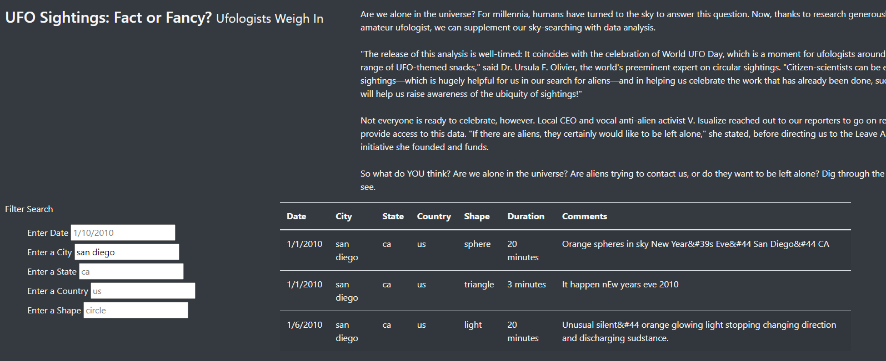
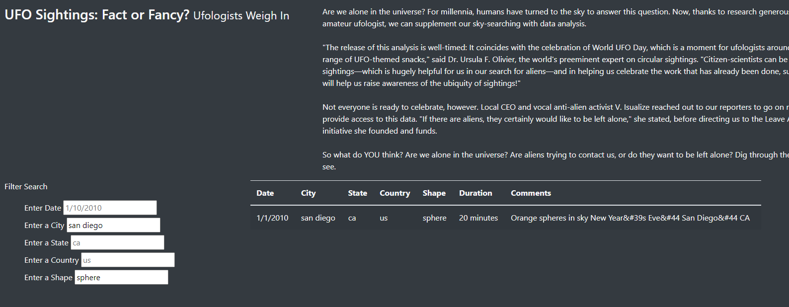

# UFOs

## Overview
The purpose of this analysis was to create an easily parsable database for aspiring UFOlogists to research recent sightings.

## Results
### To Perform a search
To perform a search, enter your query into the Filter Search table at the left side of the page. Click enter to run the search. You can also compile multiple queries at the same time. i.e. you could search for both the city and the state.

### Example results
The below pictures showcase the ways that the search can be utilized.

Here is a single parameter used.

Here is multiple parameters supplied to the filter.

## Summary
One of the drawbacks of this website is that there is no code that converts queries into a standardized format. For future iterations of this program, I recommend adding a function that converts all of the query entries to lower case so that the queries match the table entries. Additionally, I recommend that the database of UFO sightings be converted to a live source that is constantly pulling information rather than a static source that needs to be updated.
